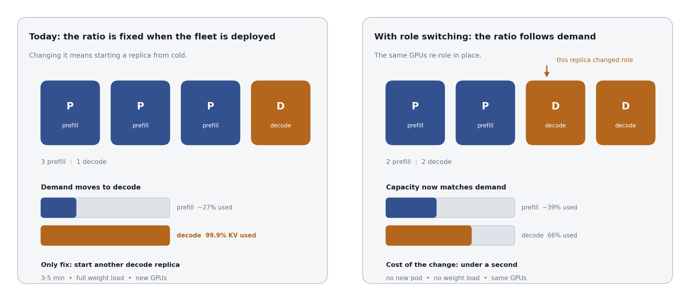
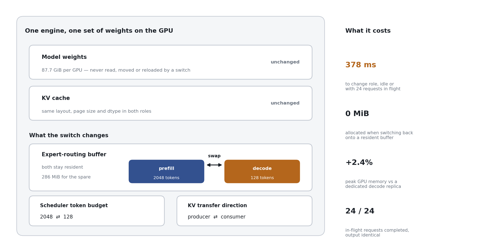

# One engine, both roles

**An inference replica can change between the prefill and decode roles in 378 ms,
without reloading model weights or starting a new pod.**

This note explains what that means, why it is worth doing, and what has and has
not yet been proven. It is written for readers who do not work on the engine.

---

## 1. The problem: the ratio is fixed, the demand is not

Large models are served with the work split into two jobs:

- **Prefill** reads the prompt. It is compute-heavy and runs in large batches.
- **Decode** writes the answer, one token at a time. It is memory-heavy and holds
  a large key-value (KV) cache.

Because the two jobs stress the hardware differently, production fleets run them
on **separate replicas** — a prefill group and a decode group — and fix the ratio
between them when the deployment is created.

Demand does not hold still. The mix of short prompts and long answers changes
through the day and between workloads. When it moves, one group saturates while
the other has capacity it cannot lend.

Today the only way to correct the balance is to **start another replica**, which
means loading the model weights from storage onto fresh GPUs. For a model of this
size that is minutes, not seconds, and it needs GPUs that may not be free.

> **This is not hypothetical.** An operator running this model in production on
> H100s has already changed his ratio once — from 10 prefill / 7 decode to
> 9 prefill / 8 decode — *because decode was the measured limiter*: his hottest
> decode rank hit **99.93% KV utilisation**. He has stated he wants to change the
> ratio at runtime. He also reports **3–5 minutes** to start a replica even on a
> node where the weights are already present.

---

## 2. The insight: the two roles are the same engine, configured differently

The reason a role change looks expensive is an assumption that a prefill replica
and a decode replica are different things. They are not.

**Their model weights are byte-identical.** What differs is a small amount of
configuration: how many tokens the scheduler admits at once, the size of the
buffer used to route tokens between experts, and which direction KV cache moves.

So a role change does not need to move the expensive thing. It needs to change
the cheap things and leave the weights exactly where they are.

The engine keeps **both** role buffers resident at the same time. Switching is
then a swap between two things already in memory rather than a teardown and
rebuild — which is what makes it take milliseconds and allocate nothing.

---

## 3. What it costs

Measured on 2 × 8 H200, GLM-5.2-FP8, expert parallelism 16, vLLM v0.28.0.

| | Measured |
|---|---|
| Change role, onto a buffer held from before | **378–387 ms** |
| Same, with 24 requests in flight | **387 ms** — 24 of 24 completed, 0 failed |
| Change role, building the buffer fresh | 1464–1587 ms idle |
| Memory to hold the spare role buffer | **286 MiB** per GPU |
| Peak memory vs a dedicated **prefill** replica | **+0.20%** |
| Peak memory vs a dedicated **decode** replica | **+2.35%** |
| Output after a round trip | identical, every run |

For comparison, on the same model **loading the weights alone takes about 104
seconds** from node-local disk — and about 1355 seconds when two replicas share
one network volume. The switch is roughly three orders of magnitude cheaper than
the alternative it replaces.

**In memory, dual-role capability costs at most 2.35% of a GPU.** Memory is not
the only cost, however, and the other one is larger — see below.

### The throughput cost: a switchable engine is a generalist

A dedicated replica is free to run the expert-matrix kernel best suited to its
one role. A switchable engine is not: the mechanism that lets both role buffers
coexist is incompatible with that kernel, so the engine falls back to a
general-purpose one that serves both roles rather than excelling at one.

Measured on one 8 × H200 node per arm, GLM-5.2-FP8, expert parallelism 8.
16 concurrent requests throughout; every prompt unique per request and per
repeat; two warm-up passes discarded and four measured.

| Engine | Decode work (mean, range) | Prefill work (mean, range) |
|---|---|---|
| Dedicated **decode** replica | **471.9** tok/s (465–481) | 29.9 tok/s (19–39) |
| **Ours** in the decode role | 407.1 tok/s (405–409) | 19.7 tok/s (18–21) |
| Dedicated **prefill** replica | 99.3 tok/s (98–100) | 38.5 tok/s (29–43) |
| **Ours** in the prefill role | **417.3** tok/s (407–445) | 41.5 tok/s (15–59) |

Two findings are solid — tight spreads, non-overlapping ranges:

- **Against us: our decode engine is 13.7% slower at decode** than a replica
  built only to decode (407 against 472 tok/s). For a decode-bound fleet that is
  a genuine price, and it is separate from the 2.35% of memory.
- **For us: a dedicated prefill replica collapses off its own role**, managing
  just 99 tok/s of decode work. Ours does **4.2× better** in the same
  configuration. Our engine turns in roughly 410 tok/s of decode in *either*
  configuration — the specialists swing between 99 and 472.

**Ignore the prefill column above** — it counts *output* tokens, and prefill's
product is the *first* token. Prefill belongs in latency, measured separately
below.

### Prefill, measured as latency (TTFT)

Time from sending the request to the first streamed chunk that carries text.
Same arms, same unique-prompt discipline, 1500-word prompts, 5 measured passes.

| Prefill role | TTFT, one request at a time | TTFT, 16 concurrent | p90 at 16 |
|---|---|---|---|
| Dedicated **prefill** replica | 533.6 ms (525–538) | **973.6 ms** | **1360 ms** |
| **Ours** in the prefill role | **364.8 ms** (360–369) | 1311.2 ms | 1915 ms |

**The comparison reverses with load, so neither engine is simply better:**

- **Unloaded, ours reaches the first token 1.46× sooner** — 365 ms against
  534 ms, with both arms holding a ±5 ms spread.
- **Under 16 concurrent prompts, ours is 1.35× slower**, and its tail is worse
  still: p90 of 1915 ms against 1360 ms.

This fits the kernel difference. The general-purpose kernel we are obliged to
use handles a single sequence very well; the batched kernel a dedicated replica
uses scales better across a concurrent batch. For an interactive, low-concurrency
prefill path ours is the faster engine; for a saturated prefill fleet it is not,
and the p90 is the number to watch.

So the trade is **13.7% of peak decode throughput** in exchange for never being
the wrong kind of replica. A fleet whose traffic mix is stable should keep
specialists and take the 13.7%. A fleet whose mix moves is today paying a 4.2×
penalty whenever demand lands on the role a replica was not built for.

*Method note. Three earlier versions of these numbers were wrong, and every
failure looked like a clean result, so they are worth naming for anyone
re-running this. A 34% decode penalty came from comparing two points on a
warm-up curve that had not converged. An apparent prefill advantage came from
re-sending one identical prompt, which the prefix cache served without doing the
work — 16 × 1800 tokens "prefilled" in 298 ms. And a 4 ms TTFT came from timing
the HTTP response headers, which vLLM sends long before prefill finishes, with
the samples additionally collapsed to n=1 by a missing newline. The harness now
makes every prompt unique per request and per repeat, discards warm-up passes,
parses the token stream rather than the headers, and flags any TTFT under 30 ms
as implausible instead of reporting it.*

### Why it is affordable now and was not before

The buffer that routes tokens between experts used to be built on a communication
layer (NVSHMEM) where the two role configurations **cannot coexist** — the old one
had to be destroyed before the new one was built. Destroying it invalidated the
engine's pre-compiled execution graphs, which forced a slower execution mode.
That penalty was measured at **4.38×** on decode throughput.

The current implementation uses a different layer whose buffers *can* coexist, so
the graphs survive the switch. It is also about **7.6× cheaper per token** of
buffer, which is why holding both roles at once went from unaffordable to
negligible.

---

## 4. What is proven, and what is not

Being precise about this matters more than the headline.

**Proven on hardware:**

- The switch itself — across all ranks, single-node and multi-node, repeatedly,
  with output identical across a round trip.
- Survival under load — 24 of 24 in-flight requests completed across a switch.
- The memory cost, measured rather than projected.
- The KV *direction* flip — all ranks move from producer to consumer and back,
  and the connector tolerates the change while live.

**Not yet proven:**

- **A real KV transfer between two engines across a switch.** Every switch
  measurement so far is one engine. We have separately confirmed that KV does
  move between a prefill and a decode engine (3.5 MiB, 0 failures, measured on
  the wire), but not yet across a role change. This is the main open claim.
- **Behaviour in the full llm-d platform**, with the real request router, rather
  than a test proxy.
- ~~Whether our engine serves as fast as a dedicated one.~~ **Now measured, and
  the answer depends on the axis.** Decode: 13.7% below a dedicated decode
  replica, 4.2× above a dedicated prefill one. Prefill latency: 1.46× *better*
  unloaded, 1.35× *worse* at 16 concurrent, with a worse tail. Neither engine
  wins outright; see both tables above.
- Behaviour at expert parallelism 32; all figures above are at 16.

---

## 5. Why this matters commercially

- **Provision for total demand, not for two peaks.** A fixed split must size
  prefill for peak prefill *and* decode for peak decode. One pool that re-roles
  is sized for the total.
- **Respond in milliseconds, not minutes.** Load shifts faster than a replica can
  be started; a fleet that can only react in minutes is always correcting the
  last problem.
- **No extra hardware.** The capability costs a fraction of one GPU's memory and
  no additional GPUs.
- **There is a named user asking for it.** The demand is not speculative.

**Where it is the wrong answer.** A fleet whose traffic mix is stable should keep
dedicated replicas and take the 13.7% of decode throughput that specialisation
buys. This is worth adopting where the ratio *moves* — and it is worth measuring
how far a given fleet's ratio actually drifts before committing to either
answer.

---

*Numbers in this note are measurements, not estimates, except where marked
otherwise. The reproduction path and the full engineering detail are in
[README.md](README.md); known failure modes are in
[TROUBLESHOOTING.md](TROUBLESHOOTING.md).*
